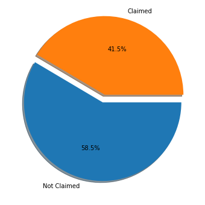
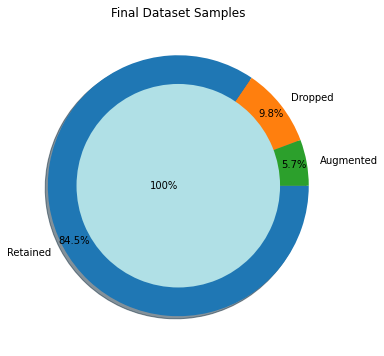
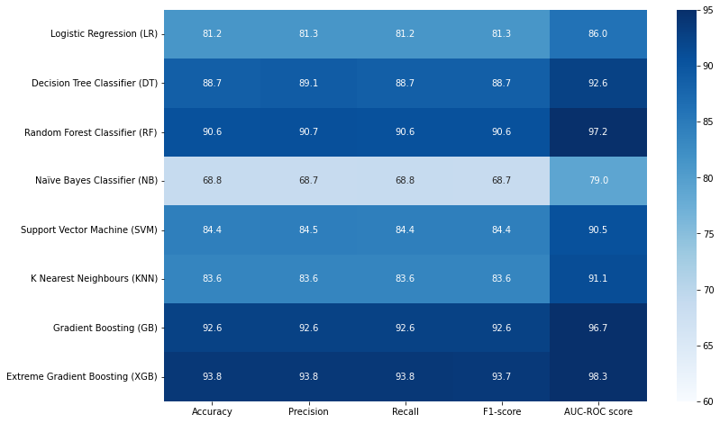
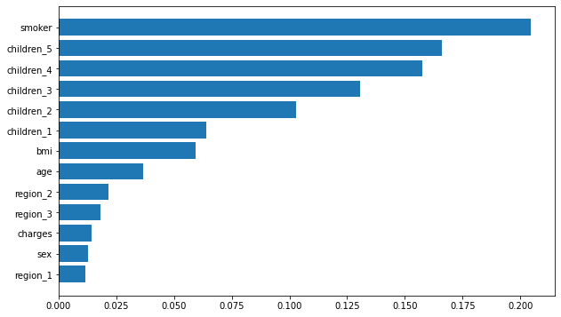

# Insurance Claim Outcome Prediction

This project looks at a practical insurance question, ie., can we predict whether a customer will file a claim based on basic profile and policy-related information?

The goal was not only to get a strong score, but also to show a clear, thoughtful workflow..

## Project Snapshot

- Problem type: binary classification
- Target variable: `insuranceclaim`
- Raw dataset size: 1,338 rows
- Final modeling dataset: 1,276 rows and 14 columns
- Best model in this notebook: Extreme Gradient Boosting (XGBoost)
- Best headline result: 93.8% accuracy, 93.7% F1-score, 98.3% ROC-AUC

## Why This Matters

In an insurance environment, a model like this can help teams spot likely claim outcomes earlier, support risk review, and guide where to focus attention. It is not a replacement for underwriting or claims judgment, but it can be a useful decision-support tool.

## Dataset

The dataset used here is the Sample Insurance Claim Prediction Dataset, adapted from the Medical Cost Personal Datasets.

It includes variables such as:

- age
- sex
- BMI
- smoking status
- region
- number of children
- medical charges
- claim outcome

## Preprocessing and Training steps

The notebook follows a simple end-to-end workflow:

1. Loaded the dataset and checked its shape, data types, unique values, and summary statistics.
2. Explored the target variable and feature distributions to understand class balance and data spread.
3. Removed duplicates and handled outliers.
4. Encoded categorical features so the models could use them.
5. Standardized the feature set before training.
6. Balanced the target classes with SMOTE.
7. Reviewed feature relationships and tested feature reduction ideas.
8. Trained and compared eight classification models.

## Data Preparation Highlights

- The raw data started with 1,338 rows.
- One duplicate row was removed during cleaning.
- Outlier handling reduced the working dataset from 1,337 rows to 1,190 rows.
- Before resampling, the target split was 638 claim cases vs 552 non-claim cases.
- After SMOTE, both classes were balanced at 638 each.
- The final modeling dataset contained 1,276 rows and 14 columns.

## Visual Summary

### Target Balance Before Resampling

The target was only slightly imbalanced at the start, but still uneven enough to justify balancing before model comparison.

### Final Dataset After Cleaning and Resampling

Most of the data was retained. About 9.8% of rows were removed during cleanup, while 5.7% were added through SMOTE to balance the classes.

### Model Comparison

This heatmap gives a quick view of how each model performed across accuracy, precision, recall, F1-score, and ROC-AUC.

### Feature Importance From the Best Model

In the XGBoost model, smoking status, the encoded children features, BMI, age, and charges carried much of the predictive signal.

## Model Results

The notebook compares eight models. The table below summarizes the main results.

| Model | Accuracy | F1-score | ROC-AUC |
| --- | ---: | ---: | ---: |
| Logistic Regression | 81.2% | 81.3% | 86.0% |
| Decision Tree | 88.7% | 88.7% | 92.6% |
| Random Forest | 90.6% | 90.6% | 97.2% |
| Naive Bayes | 68.8% | 68.7% | 79.0% |
| Support Vector Machine | 84.4% | 84.4% | 90.5% |
| K-Nearest Neighbors | 83.6% | 83.6% | 91.1% |
| Gradient Boosting | 92.6% | 92.6% | 96.7% |
| Extreme Gradient Boosting | 93.8% | 93.7% | 98.3% |

## Main Takeaways

- Tree-based ensemble models were the strongest group in this analysis.
- XGBoost gave the best overall result and the strongest ROC-AUC.
- Gradient Boosting and Random Forest also performed very well and were close behind.
- Logistic Regression was a solid baseline, even though it was clearly behind the top ensemble models.
- Naive Bayes was the weakest model in this comparison.

## Notes and Next Steps

This notebook is a strong exploratory case study, but there are a few things I would tighten in a production version:

- move preprocessing and resampling into a single training pipeline
- validate the workflow with stricter cross-validation
- review whether `charges` is available early enough for a real-world prediction setting
- add threshold tuning based on business costs for false positives and false negatives

## Repository Contents

- `insurance-claim-prediction.ipynb`: full notebook analysis
- `Insurance.csv`: dataset used in the notebook
- `assets/`: exported plots used in this README